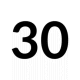
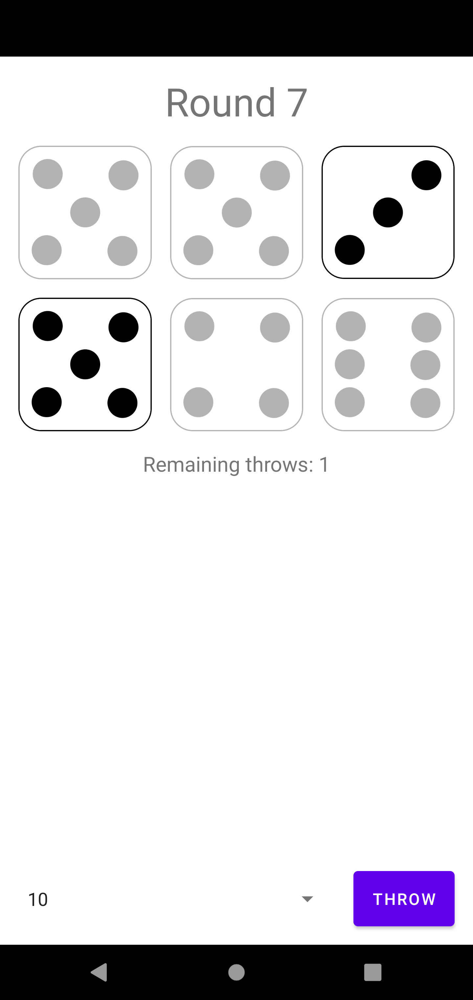
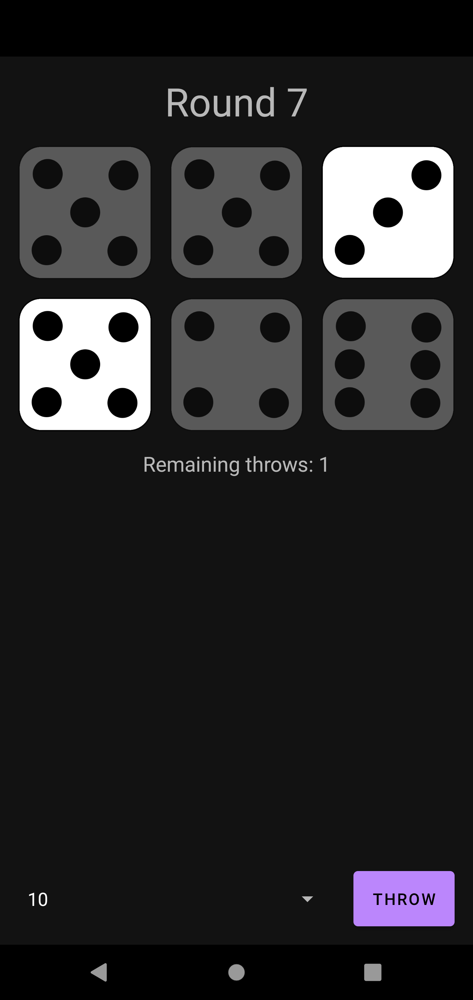

<!-- PROJECT SHIELDS -->
<!--
*** I'm using markdown "reference style" links for readability.
*** Reference links are enclosed in brackets [ ] instead of parentheses ( ).
*** See the bottom of this document for the declaration of the reference variables
*** for contributors-url, forks-url, etc. This is an optional, concise syntax you may use.
*** https://www.markdownguide.org/basic-syntax/#reference-style-links
-->
[![Forks][forks-shield]][forks-url]
[![Stargazers][stars-shield]][stars-url]
[![Issues][issues-shield]][issues-url]
[![MIT License][license-shield]][license-url]
[![LinkedIn][linkedin-shield]][linkedin-url]


<!-- PROJECT LOGO -->
<br />
<p align="center">
  <a href="https://github.com/konradrej/thirty">
    
  </a>

  <h3 align="center">Thirty</h3>

  <p align="center">
    An android implemenetation of the game thirty.
    <br />
    <a href="https://github.com/konradrej/thirty/issues">Report Bug</a>
    ·
    <a href="https://github.com/konradrej/thirty/issues">Request Feature</a>
  </p>
</p>


<!-- TABLE OF CONTENTS -->
<details open="open">
  <summary><h2 style="display: inline-block">Table of Contents</h2></summary>
  <ol>
    <li>
      <a href="#about-the-project">About The Project</a>
    </li>
    <li>
      <a href="#screenshots">Screenshots</a>
    </li>
    <li>
      <a href="#getting-started">Getting Started</a>
      <ul>
        <li><a href="#prerequisites">Prerequisites</a></li>
        <li><a href="#installation">Installation</a></li>
      </ul>
    </li>
    <li><a href="#license">License</a></li>
  </ol>
</details>

<!-- ABOUT THE PROJECT -->
## About The Project

The app implements the game thirty. You play the thirty game by throwing the dice 3 times, before throw 2 and 3 you can select which dice you would like to keep (by pressing them). After the third throw you select a scoring method (Low, sum all digits less or equal to 3; 4-12 you get points for as many dice combinations that add up to the selected digits) and press count score to start the next round. You can only pick each scoring option once each game.


<!-- SCREENSHOTS -->
## Screeshots
<p align="center">
    
    
</p>


<!-- GETTING STARTED -->
## Getting Started

To get a local copy up and running follow these simple steps.

### Prerequisites
* Android Studio

### Installation

1. Clone the repo
   ```sh
   git clone https://github.com/konradrej/thirty.git
   ```


<!-- LICENSE -->
## License

Distributed under the MIT License. See `LICENSE` for more information.


<!-- MARKDOWN LINKS & IMAGES -->
<!-- https://www.markdownguide.org/basic-syntax/#reference-style-links -->
[forks-shield]: https://img.shields.io/github/forks/konradrej/repo.svg?style=for-the-badge
[forks-url]: https://github.com/konradrej/Thirty/network/members
[stars-shield]: https://img.shields.io/github/stars/konradrej/repo.svg?style=for-the-badge
[stars-url]: https://github.com/konradrej/Thirty/stargazers
[issues-shield]: https://img.shields.io/github/issues/konradrej/repo.svg?style=for-the-badge
[issues-url]: https://github.com/konradrej/Thirty/issues
[license-shield]: https://img.shields.io/github/license/konradrej/repo.svg?style=for-the-badge
[license-url]: https://github.com/konradrej/Thirty/blob/master/LICENSE.txt
[linkedin-shield]: https://img.shields.io/badge/-LinkedIn-black.svg?style=for-the-badge&logo=linkedin&colorB=555
[linkedin-url]: https://linkedin.com/in/konradrej